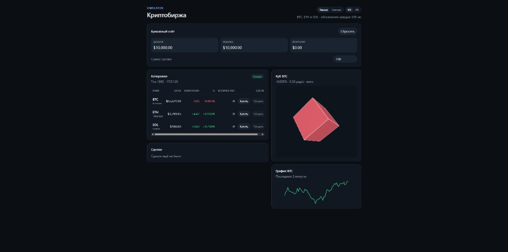
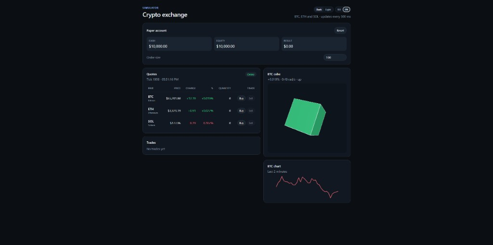

# Симулятор криптобиржи

[English](#english)

Учебный каркас: NestJS публикует случайные котировки BTC, ETH и SOL по WebSocket, Angular показывает их в таблице и крутит 3D-куб со скоростью, которая зависит от изменения цены Bitcoin.



## Стек

- API: NestJS 11, Socket.IO, RxJS `timer`
- Web: Angular 21, RxJS `fromEvent`, Angular Signals, ngx-translate, Three.js

## Запуск

Нужны Docker и Docker Compose. API и Angular собираются в отдельные образы и запускаются своими контейнерами.

```bash
npm start
```

Та же команда без npm: `docker compose up --build`. Остановка: `npm run stop`.

- API: http://localhost:3000/health
- Сокет: `http://localhost:3000/market`, событие `market.tick` каждые 500 мс
- Web: http://localhost:4200

Браузер открывает страницу с хоста. Без внешнего адреса сокет указывает на `http://localhost:3000/market`. Контейнеры между собой по этому адресу не ходят.

Публичный адрес задаётся снаружи, без правки кода. В `.env` рядом с `docker-compose.yml` или в окружении оболочки:

```bash
PUBLIC_HOST=213.21.241.146
```

API возьмёт из него origin страницы `http://<PUBLIC_HOST>:4200`, контейнер web запишет сокет `http://<PUBLIC_HOST>:3000/market` в `app-config.js` при старте. Явные `CLIENT_ORIGIN` (список через запятую) и `MARKET_SOCKET_URL` перекрывают этот адрес. Если переменных нет, остаются `http://localhost:4200`, `http://127.0.0.1:4200` и локальный сокет. Порт API — `PORT` (по умолчанию `3000`).

Локально без Docker, из каталога приложения: `npm install` и `npm run start:dev` для API, `npm start` для Angular. Тесты: `npm test` в корне, либо `npm run test:api` и `npm run test:web`.

## Поток данных

```text
Price step  ->  MarketService  ->  MarketGateway
                                      |  market.tick / 500ms
                                      v
MarketSocketService (Observable)  ->  MarketStateService (Signal)
                                      |                 |
                                      v                 v
                                 MarketBoard      RotatingCubeScene
```

Контракт сообщения продублирован в двух файлах и должен совпадать:

- `apps/api/src/market/market.types.ts`
- `apps/web/src/app/core/market/market.models.ts`

```ts
{
  sequence: number;
  emittedAt: string;
  quotes: Array<{
    symbol: 'BTC' | 'ETH' | 'SOL';
    name: string;
    price: number;
    change: number;
    changePercent: number;
  }>;
}
```

`change` и `changePercent` — дельта относительно предыдущего тика.

## Структура

```text
apps/api/Dockerfile      образ NestJS
apps/web/Dockerfile      образ Angular за nginx
docker-compose.yml       контейнеры api и web

apps/api/src/market
  price-step.ts        чистая функция случайного шага
  market.service.ts    общее состояние котировок
  market.gateway.ts    Socket.IO namespace /market
  market.module.ts

apps/web/src/app
  core/i18n            ngx-translate, словари public/i18n
  core/market          сокет, Observable и Signals
  features/market-board
  features/price-scene
    btc-rotation.ts          Δ% BTC -> рад/с
    rotating-cube.scene.ts   сцена Three.js без Angular
    price-scene.ts           связывание signal и сцены
```

Скорость куба: `sign(Δ%) * (0.35 + min(|Δ%|, 1) * 7)` радиан в секунду. Положительный тик крутит куб в одну сторону и красит его зелёным, отрицательный — в другую и красным.

## English

[Русский](#симулятор-криптобиржи)

A teaching skeleton: NestJS publishes random BTC, ETH, and SOL quotes over a WebSocket, and Angular shows them in a table and spins a 3D cube whose speed follows the Bitcoin price change.



### Stack

- API: NestJS 11, Socket.IO, RxJS `timer`
- Web: Angular 21, RxJS `fromEvent`, Angular Signals, ngx-translate, Three.js

### Run

Docker and Docker Compose are required. The API and Angular app are built into separate images and run in their own containers.

```bash
npm start
```

The same command without npm: `docker compose up --build`. Stop with `npm run stop`.

- API: http://localhost:3000/health
- Socket: `http://localhost:3000/market`, event `market.tick` every 500 ms
- Web: http://localhost:4200

The browser opens the page on the host. Without a public address the socket points at `http://localhost:3000/market`. The containers do not talk to each other at that address.

Set the public address from the outside, without editing code. Put it in `.env` next to `docker-compose.yml`, or in the shell environment:

```bash
PUBLIC_HOST=213.21.241.146
```

The API turns that into the page origin `http://<PUBLIC_HOST>:4200`. The web container writes the socket `http://<PUBLIC_HOST>:3000/market` into `app-config.js` when it starts. An explicit `CLIENT_ORIGIN` (comma-separated list) and `MARKET_SOCKET_URL` override that address. With no variables set, the defaults are `http://localhost:4200`, `http://127.0.0.1:4200`, and the local socket. The API port is `PORT` (default `3000`).

Without Docker, from each app directory: `npm install`, then `npm run start:dev` for the API and `npm start` for Angular. Tests: `npm test` at the repo root, or `npm run test:api` and `npm run test:web`.

### Data flow

```text
Price step  ->  MarketService  ->  MarketGateway
                                      |  market.tick / 500ms
                                      v
MarketSocketService (Observable)  ->  MarketStateService (Signal)
                                      |                 |
                                      v                 v
                                 MarketBoard      RotatingCubeScene
```

The message contract is duplicated in two files and must stay the same:

- `apps/api/src/market/market.types.ts`
- `apps/web/src/app/core/market/market.models.ts`

```ts
{
  sequence: number;
  emittedAt: string;
  quotes: Array<{
    symbol: 'BTC' | 'ETH' | 'SOL';
    name: string;
    price: number;
    change: number;
    changePercent: number;
  }>;
}
```

`change` and `changePercent` are the delta from the previous tick.

### Layout

```text
apps/api/Dockerfile      NestJS image
apps/web/Dockerfile      Angular image behind nginx
docker-compose.yml       api and web containers

apps/api/src/market
  price-step.ts        pure random-step function
  market.service.ts    shared quote state
  market.gateway.ts    Socket.IO namespace /market
  market.module.ts

apps/web/src/app
  core/i18n            ngx-translate, dictionaries in public/i18n
  core/market          socket, Observable, and Signals
  features/market-board
  features/price-scene
    btc-rotation.ts          BTC Δ% -> rad/s
    rotating-cube.scene.ts   Three.js scene without Angular
    price-scene.ts           binds the signal to the scene
```

Cube speed: `sign(Δ%) * (0.35 + min(|Δ%|, 1) * 7)` radians per second. An upward tick spins the cube one way and paints it green. A downward tick spins it the other way and paints it red.
